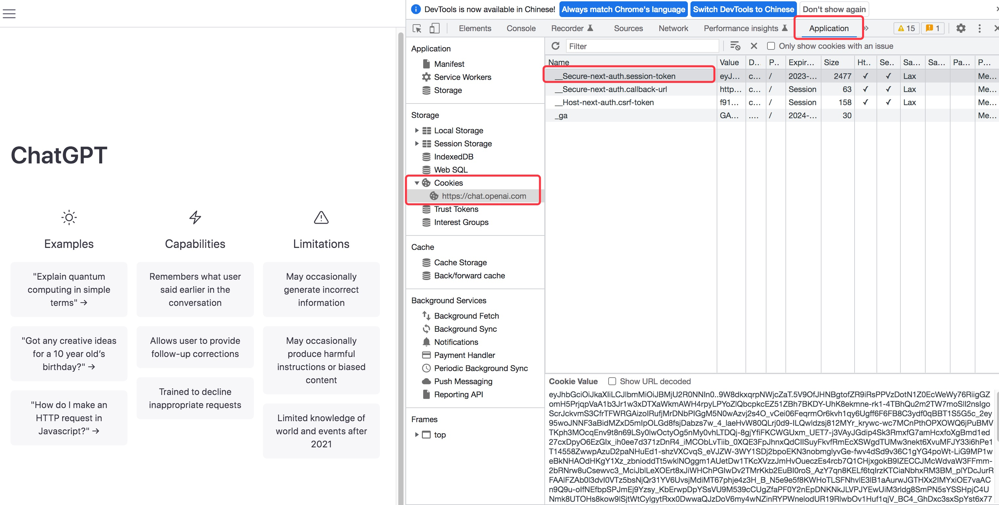

# 简介

本项目是基于ChatGPT模型实现的微信聊天机器人，通过[revChatGPT](https://github.com/acheong08/ChatGPT) 访问 ChatGPT接口，使用 [itchat](https://github.com/littlecodersh/ItChat) 实现微信消息的接收和发送。已实现的功能如下：

- [x] **基础功能：** 接收私聊及群组中的微信消息，使用ChatGPT生成回复内容，完成自动回复
- [x] **规则定制化：** 支持私聊中按指定规则触发自动回复，支持对群组设置自动回复白名单
- [x] **会话上下文：** 支持用户维度的上下文保存和过期清理
- [x] **Session刷新：** 支持ChatGPT session的定时刷新保鲜
- [x] **多账号：** 支持多微信账号同时运行
 
 
# 快速开始

## 准备
###  1.网页版微信

本方案中实现微信消息的收发依赖了网页版微信的登录，可以尝试登录 <https://wx.qq.com/>，如果能够成功登录就可以开始后面的步骤了。

### 2.运行环境

操作系统支持 Linux、MacOS、Windows，并需安装 `Python3.6` 及以上版本。推荐使用Linux服务器，可以托管在后台长期运行。

### 3.项目安装

克隆本项目代码：

```bash
https://github.com/zhayujie/chatgpt-on-wechat
```

安装所需依赖：

```bash
pip3 install revChatGPT
pip3 install itchat
```


## 配置

配置文件在根目录的 `config.json` 中，示例文件及各配置项解析如下： (TODO)

```bash
{ 
  "session_token": "YOUR SESSION TOKEN",           # 从页面获取的token
  "single_chat_prefix": ["bot", "@bot"],           # 私聊触发自动回复的前缀
  "group_chat_prefix": ["@bot"],                   # 群聊触发自动回复的前缀
  "group_name_white_list": ["群名称1", "群名称2"]    # 开启自动回复的群名称
}
```

其中 session_token 需要在openAI网页端获取：

- 打开 <https://chat.openai.com/chat> 并登录，可使用测试账号 (lgfo353p@linshiyouxiang.net, 密码yy123123)，账号来源为该[文章](https://www.bilibili.com/read/cv20257021)
- F12 进入开发者控制台
- 选择Application -> Cookies，将 session-token 中的值填入配置中




## 运行

1.如果是开发机本地调试，直接执行：

```
python3 app.py
```
终端输出二维码后，使用微信进行扫码，当输出 "Start auto replying" 时表示自动回复程序已经成功运行了。


2.如果是服务器部署，则使用nohup在后台运行：

```
nohup python3 app.py &
```

## 使用

