<div align="center">
<h1>Dify on WeChat</h1>

本项目[dify-on-wechat](https://github.com/hanfangyuan4396/dify-on-wechat)为 [chatgpt-on-wechat](https://github.com/zhayujie/chatgpt-on-wechat)下游分支

额外对接了LLMOps平台 [Dify](https://github.com/langgenius/dify)，支持Dify智能助手模型，调用工具和知识库，支持Dify工作流。

Dify接入微信生态的**详细教程**请查看文章 [**手摸手教你把 Dify 接入微信生态**](https://docs.dify.ai/v/zh-hans/learn-more/use-cases/dify-on-wechat)

如果我的项目对您有帮助请点一个star吧~
</div>


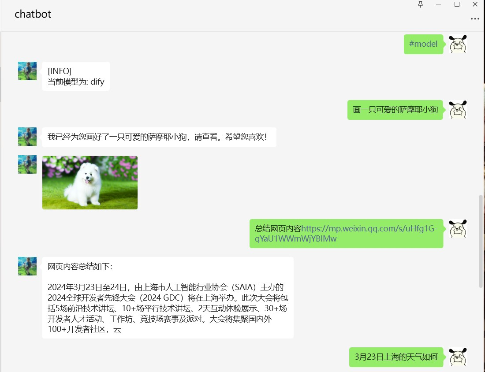

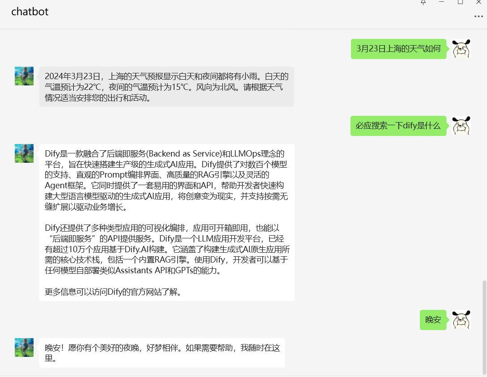

基本的dify workflow api支持

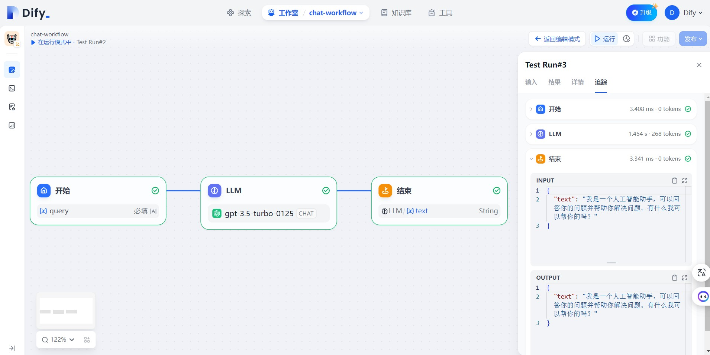

目前Dify已经测试过的通道如下：

- [x] **个人微信**
- [x] **企业微信应用** 
- [x] **企业服务公众号**
- [x] **企业微信个人号(仅windows系统)**
- [ ] **个人订阅公众号** 待测试
- [ ] **企业微信客服** 待测试
- [ ] **钉钉** 待测试
- [ ] **飞书** 待测试

# 交流群


|||
|:-:|:-:|
|添加我的微信拉你进交流群|开源不易，感谢打赏🎉|


# 最新功能
## 1. 支持gewechat登录微信
基于[Gewechat](https://github.com/Devo919/Gewechat)项目实现的微信个人号通道,使用ipad协议登录,相比itchat协议更稳定。

> 1. gewechat要求必须搭建服务到**同省服务器**或者电脑里方可正常使用
> 2. 此项目仅用于个人娱乐场景，请勿用于任何商业场景

### 1.1 快速启动gewechat机器人

#### 部署gewechat服务

```bash
# 从阿里云镜像仓库拉取(国内)
docker pull registry.cn-chengdu.aliyuncs.com/tu1h/wechotd:alpine
docker tag registry.cn-chengdu.aliyuncs.com/tu1h/wechotd:alpine gewe

# 创建数据目录并启动服务
mkdir -p gewechat/data  
docker run -itd -v gewechat/data:/root/temp -p 2531:2531 -p 2532:2532 --restart=always --name=gewe gewe
```

#### 配置dify-on-wechat

gewechat相关配置如下，注意**channel_type设置为gewechat**

```bash 
{
    "channel_type": "gewechat",  # 通道类型设置为gewechat    
    "gewechat_token": "",        # 首次登录可留空,自动获取
    "gewechat_app_id": "",       # 首次登录可留空,自动获取
    "gewechat_base_url": "http://本机ip:2531/v2/api",  # gewechat服务API地址
    "gewechat_callback_url": "http://本机ip:9919/v2/api/callback/collect", # 回调地址
    "gewechat_download_url": "http://本机ip:2532/download" # 文件下载地址
}
```
**请务必查看详细配置**： [gewechat接入文档](./docs/gewechat/README.md)

#### 启动机器人

```bash
python app.py
```
启动成功后，可以看到如下日志信息，注意token和appid会**自动保存**到config.json，无需手动保存

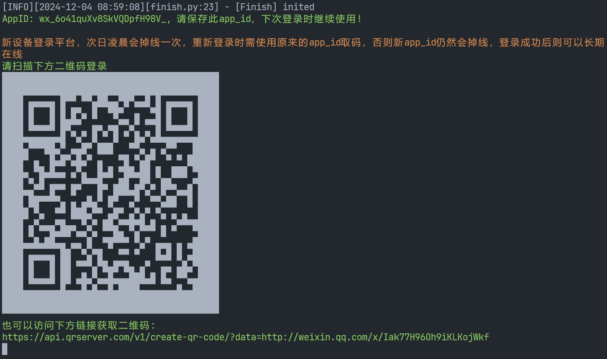


## 2. 支持企业微信个人号（仅支持windows系统）
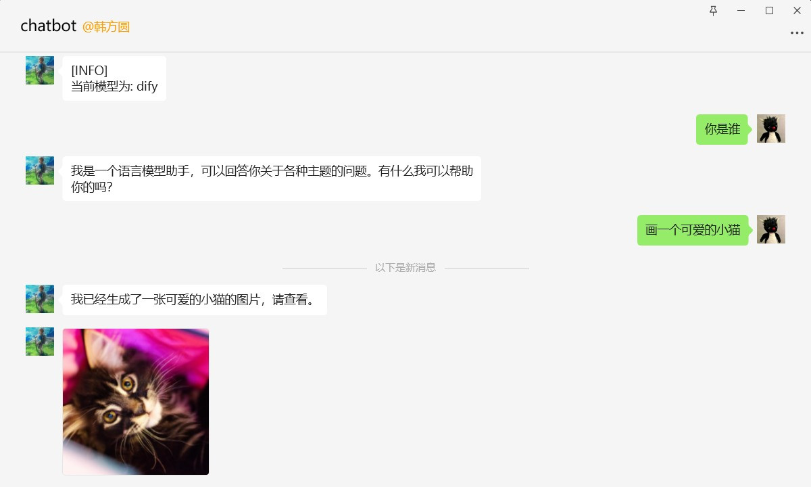

> 1. 有**封号风险**，请使用企业微信**小号**测试
> 2. 在登录旧版本的企业微信时可能会出现企业微信版本过低，无法登录情况，参考[issue1525](https://github.com/zhayujie/chatgpt-on-wechat/issues/1525)，请尝试更换其他企业微信号重试

### 2.1 快速启动企业微信个人号机器人

#### 安装指定版本企业微信

[WeCom_4.0.8.6027.exe官方下载链接](https://dldir1.qq.com/wework/work_weixin/WeCom_4.0.8.6027.exe)

[WeCom_4.0.8.6027.exe阿里云盘备份](https://www.alipan.com/s/UxQHrZ5WoxS)

[WeCom_4.0.8.6027.exe夸克网盘备份](https://pan.quark.cn/s/1d06b91b40af)

#### 下载项目安装依赖

参考[**手摸手教你把 Dify 接入微信生态**](https://docs.dify.ai/v/zh-hans/learn-more/use-cases/dify-on-wechat)，下载本项目，安装python依赖

#### 安装ntwork依赖

由于ntwork的安装源不是很稳定，可以下载对应的whl文件，使用whl文件离线安装ntwork

首先需要查看你的python版本，在命令行中输入python查看版本信息，然后在[ntwork-whl](https://github.com/hanfangyuan4396/ntwork-bin-backup/tree/main/ntwork-whl)目录下找到对应的whl文件，运行`pip install xx.whl`安装ntwork依赖，注意"xx.whl"更换为whl文件的**实际路径**。

例如我的python版本信息为

"Python 3.8.5 (default, Sep  3 2020, 21:29:08) [MSC v.1916 64 bit (AMD64)]"

可以看到python版本是**3.8.5**，并且是**AMD64**，所以对应的whl文件为**ntwork-0.1.3-cp38-cp38-win_amd64.whl**，需要执行如下命令安装
```sh
pip install your-path/ntwork-0.1.3-cp38-cp38-win_amd64.whl
```

#### 填写配置文件

我们在项目根目录创建名为config.json的文件，文件内容如下，请根据教程参考[**手摸手教你把 Dify 接入微信生态**](https://docs.dify.ai/v/zh-hans/learn-more/use-cases/dify-on-wechat)获取dify_api_base、dify_api_key、dify_app_type信息，注意channel_type填写为 **wework**

```json
{ 
  "dify_api_base": "https://api.dify.ai/v1",
  "dify_api_key": "app-xxx",
  "dify_app_type": "chatbot",
  "channel_type": "wework",
  "model": "dify",
  "single_chat_prefix": [""],
  "single_chat_reply_prefix": "",
  "group_chat_prefix": ["@bot"],
  "group_name_white_list": ["ALL_GROUP"]
}
```

#### 登录企业微信

务必提前在电脑扫码登录企业微信

#### 启动机器人

运行如下命令启动机器人
```sh
python app.py
```
我们可以看到终端输出如下信息，等待wework程序初始化完成，最后启动成功~
```
[INFO][2024-04-30 21:16:04][wework_channel.py:185] - 等待登录······
[INFO][2024-04-30 21:16:05][wework_channel.py:190] - 登录信息:>>>user_id:xxx>>>>>>>>name:
[INFO][2024-04-30 21:16:05][wework_channel.py:191] - 静默延迟60s，等待客户端刷新数据，请勿进行任何操作······
[INFO][2024-04-30 21:17:05][wework_channel.py:224] - wework程序初始化完成········
```

## 3. 集成[JinaSum](https://github.com/hanfangyuan4396/jina_sum)插件
使用Jina Reader和ChatGPT支持总结公众号、小红书、知乎等分享卡片链接，配置详情请查看[JinaSum](https://github.com/hanfangyuan4396/jina_sum)

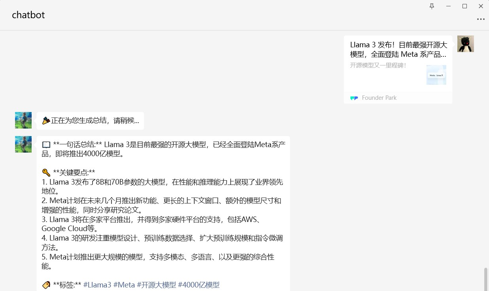
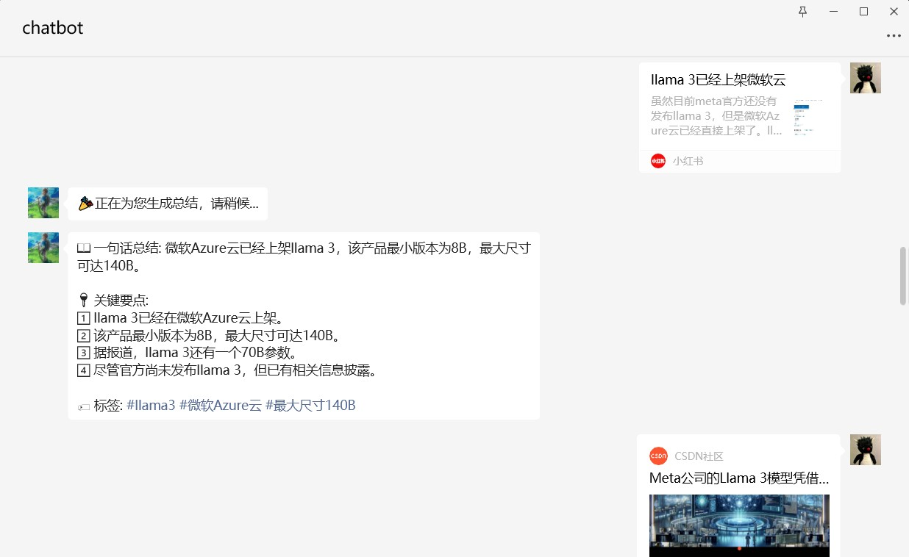

## 4. 新增[CustomDifyApp](https://github.com/hanfangyuan4396/dify-on-wechat/tree/master/plugins/custom_dify_app)插件
支持根据群聊名称关键词自动切换不同的Dify应用，也支持为单聊配置专门的Dify应用。

例如，在与AI助手进行私聊时，自动调用企业内部员工助手Dify应用；在xx平台技术支持群中@AI助手时，则自动切换至该平台的技术支持Dify应用。

配置详情请查看 [CustomDifyApp](https://github.com/hanfangyuan4396/dify-on-wechat/tree/master/plugins/custom_dify_app)

## 5. 支持Dify Chatflow & Workflow
dify官网已正式上线工作流模式，可以导入本项目下的[dsl文件](./dsl/chat-workflow.yml)快速创建工作流进行测试。工作流输入变量名称十分灵活，对于**工作流类型**的应用，本项目**约定工作流的输入变量命名为`query`**，**输出变量命名为`text`**。

(ps: 感觉工作流类型应用不太适合作为聊天机器人，现在它还没有会话的概念，需要自己管理上下文。但是它可以调用各种工具，通过http请求和外界交互，适合执行业务逻辑复杂的任务；它可以导入导出工作流dsl文件，方便分享移植。也许以后dsl文件+配置文件就可以作为本项目的一个插件。)
## 6. 支持COZE API

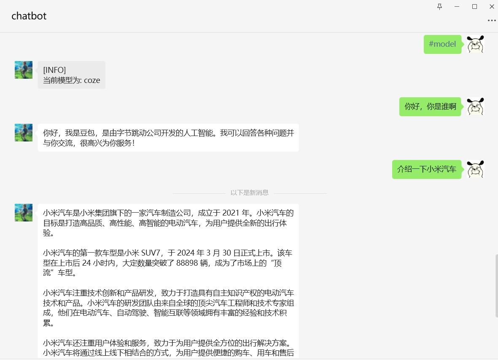

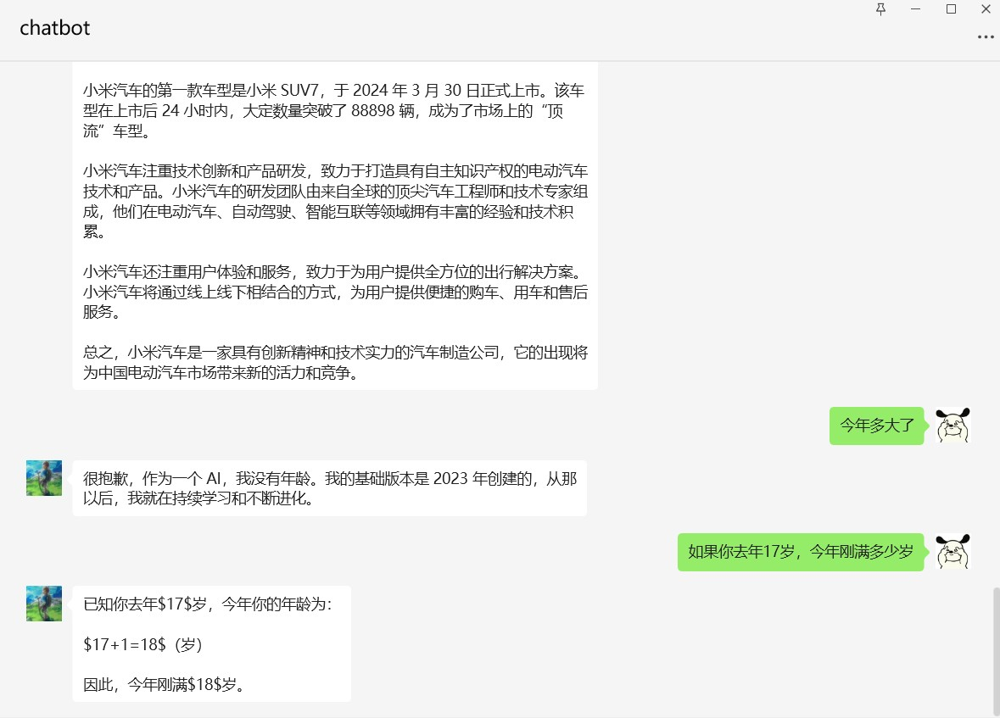


### 6.1 如何快速启动coze微信机器人

- 请参照**快速开始**步骤克隆源码并安装依赖

- 按照下方coze api config.json示例文件进行配置
以下是对默认配置的说明，可根据需要进行自定义修改（**如果复制下方的示例内容，请去掉注释**）
```bash
# coze config.json文件内容示例
{
  "coze_api_base": "https://api.coze.cn/open_api/v2",  # coze base url
  "coze_api_key": "xxx",                               # coze api key
  "coze_bot_id": "xxx",                                # 根据url获取coze_bot_id https://www.coze.cn/space/{space_id}/bot/{bot_id}
  "channel_type": "wx",                                # 通道类型，当前为个人微信
  "model": "coze",                                     # 模型名称，当前对应coze平台
  "single_chat_prefix": [""],                          # 私聊时文本需要包含该前缀才能触发机器人回复
  "single_chat_reply_prefix": "",                      # 私聊时自动回复的前缀，用于区分真人
  "group_chat_prefix": ["@bot"],                       # 群聊时包含该前缀则会触发机器人回复
  "group_name_white_list": ["ALL_GROUP"]               # 机器人回复的群名称列表
}
```

上述示例文件是个人微信对接coze的极简配置，详细配置说明需要查看config.py，注意**不要修改config.py中的值**，config.py只是校验是否是有效的key，最终**生效的配置请在config.json修改**。

- 启动程序

```
python3 app.py                                    # windows环境下该命令通常为 python app.py
```


特别感谢 [**@绛烨**](https://github.com/jiangye520) 提供内测coze api key

## 7. 支持dify voice

dify语音相关配置如下，另外需要在dify应用中开启语音转文字以及文字转语音功能，注意语音功能需要**安装ffmpeg依赖**

```bash
{
  "dify_api_base": "https://api.dify.ai/v1",
  "dify_api_key": "app-xxx",
  "dify_app_type": "chatbot",
  "speech_recognition": true,  # 是否开启语音识别
  "voice_reply_voice": true,   # 是否使用语音回复语音
  "always_reply_voice": false, # 是否一直使用语音回复
  "voice_to_text": "dify",     # 语音识别引擎
  "text_to_voice": "dify"      # 语音合成引擎
}
```

# 更新日志
- 2024/12/04 新增 [gewechat](https://github.com/Devo919/Gewechat) 通道，相比itchat更稳定。
- 2024/10/01 新增插件CustomDifyApp与GroupAtAutoreply，CustomDifyApp支持根据群聊名称关键词自动切换不同的Dify应用，GroupAtAutoreply支持群聊艾特自动回复，贡献者[**blankbro**](https://github.com/blankbro)
- 2024/09/18 支持dify voice
- 2024/08/09 dify chatbot类型应用支持解析markdown格式响应，分别发送文本、图片和文件
- 2024/08/04 支持dify图片识别功能
- 2024/08/03 微信支持通过web ui扫码登录或异常重启，已适配docker容器
- 2024/08/01 同步上游chatgpt on wechat最新功能，docker镜像地址支持阿里云容器仓库ACR
- 2024/04/30 支持windows环境下企业微信个人号
- 2024/04/24 集成JinaSum插件，修复总结微信公众号文章，修复dify usage key error, 修复dify私有部署的图片url错误
- 2024/04/16 支持基本的企业微信客服通道，感谢[**@lei195827**](https://github.com/lei195827), [**@sisuad**](https://github.com/sisuad) 的贡献
- 2024/04/14 Suno音乐插件，Dify on WeChat对接详细教程，config文件bug修复
- 2024/04/08 支持聊天助手类型应用内置的Chatflow，支持dify基础的对话Workflow
- 2024/04/04 支持docker部署
- 2024/03/31 支持coze api(内测版)
- 2024/03/29 支持dify基础的对话工作流，由于dify官网还未上线工作流，需要自行部署测试 [0.6.0-preview-workflow.1](https://github.com/langgenius/dify/releases/tag/0.6.0-preview-workflow.1)。

# 快速开始

接入非Dify机器人可参考原项目文档 [chatgpt-on-wechat](https://github.com/zhayujie/chatgpt-on-wechat)、[项目搭建文档](https://docs.link-ai.tech/cow/quick-start)

Dify接入微信生态的**详细教程**请查看文章 [**手摸手教你把 Dify 接入微信生态**](https://docs.dify.ai/v/zh-hans/learn-more/use-cases/dify-on-wechat)

下文介绍如何快速接入Dify

## 准备

### 1. 账号注册

进入[Dify App](https://cloud.dify.ai) 官网注册账号，创建一个应用并发布，然后在概览页面创建保存api密钥，同时记录api url，一般为https://api.dify.ai/v1

### 2.运行环境

支持 Linux、MacOS、Windows 系统（可在Linux服务器上长期运行)，同时需安装 `Python`。

python推荐3.8以上版本，已在ubuntu测试过3.11.6版本可以成功运行。

**(1) 克隆项目代码：**

```bash
git clone https://github.com/hanfangyuan4396/dify-on-wechat
cd dify-on-wechat/
```

**(2) 安装核心依赖 (必选)：**
> 能够使用`itchat`创建机器人，并具有文字交流功能所需的最小依赖集合。
```bash
pip3 install -r requirements.txt  # 国内可以在该命令末尾添加 "-i https://mirrors.aliyun.com/pypi/simple" 参数，使用阿里云镜像源安装依赖
```

**(3) 拓展依赖 (可选，建议安装)：**

```bash
pip3 install -r requirements-optional.txt # 国内可以在该命令末尾添加 "-i https://mirrors.aliyun.com/pypi/simple" 参数，使用阿里云镜像源安装依赖
```
> 如果某项依赖安装失败可注释掉对应的行再继续

## 配置

配置文件的模板在根目录的`config-template.json`中，需复制该模板创建最终生效的 `config.json` 文件：

```bash
  cp config-template.json config.json
```

然后在`config.json`中填入配置，以下是对默认配置的说明，可根据需要进行自定义修改（如果复制下方的示例内容，请**去掉注释**, 务必保证正确配置**dify_app_type**）：

```bash
# dify config.json文件内容示例
{ 
  "dify_api_base": "https://api.dify.ai/v1",    # dify base url
  "dify_api_key": "app-xxx",                    # dify api key
  "dify_app_type": "chatbot",                   # dify应用类型 chatbot(对应聊天助手)/agent(对应Agent)/workflow(对应工作流)，默认为chatbot
  "dify_convsersation_max_messages": 5,         # dify目前不支持设置历史消息长度，暂时使用超过最大消息数清空会话的策略，缺点是没有滑动窗口，会突然丢失历史消息，当设置的值小于等于0，则不限制历史消息长度
  "channel_type": "wx",                         # 通道类型，当前为个人微信
  "model": "dify",                              # 模型名称，当前对应dify平台
  "single_chat_prefix": [""],                   # 私聊时文本需要包含该前缀才能触发机器人回复
  "single_chat_reply_prefix": "",               # 私聊时自动回复的前缀，用于区分真人
  "group_chat_prefix": ["@bot"],                # 群聊时包含该前缀则会触发机器人回复
  "group_name_white_list": ["ALL_GROUP"],       # 机器人回复的群名称列表
  "image_recognition": true,                    # 是否开启图片理解功能，需保证对应的dify应用已开启视觉功能
  "speech_recognition": true,                   # 是否开启语音识别
  "voice_reply_voice": true,                    # 是否使用语音回复语音
  "always_reply_voice": false,                  # 是否一直使用语音回复
  "voice_to_text": "dify",                      # 语音识别引擎
  "text_to_voice": "dify"                       # 语音合成引擎
}
```

上述示例文件是个人微信对接dify的极简配置，详细配置说明需要查看config.py，注意**不要修改config.py中的值**，config.py只是校验是否是有效的key，最终**生效的配置请在config.json修改**。

## 运行

### 1.本地运行

如果是开发机 **本地运行**，直接在项目根目录下执行：

```bash
python3 app.py                                    # windows环境下该命令通常为 python app.py
```

终端输出二维码后，使用微信进行扫码，当输出 "Start auto replying" 时表示自动回复程序已经成功运行了（注意：用于登录的微信需要在支付处已完成实名认证）。扫码登录后你的账号就成为机器人了，可以在微信手机端通过配置的关键词触发自动回复 (任意好友发送消息给你，或是自己发消息给好友)，参考[#142](https://github.com/zhayujie/chatgpt-on-wechat/issues/142)。

### 2.服务器部署

使用nohup命令在后台运行程序：

```bash
nohup python3 app.py & tail -f nohup.out          # 在后台运行程序并通过日志输出二维码
```
扫码登录后程序即可运行于服务器后台，此时可通过 `ctrl+c` 关闭日志，不会影响后台程序的运行。使用 `ps -ef | grep app.py | grep -v grep` 命令可查看运行于后台的进程，如果想要重新启动程序可以先 `kill` 掉对应的进程。日志关闭后如果想要再次打开只需输入 `tail -f nohup.out`。此外，`scripts` 目录下有一键运行、关闭程序的脚本供使用。

> **多账号支持：** 将项目复制多份，分别启动程序，用不同账号扫码登录即可实现同时运行。

> **特殊指令：** 用户向机器人发送 **#reset** 即可清空该用户的上下文记忆。

### 3.Docker部署

```bash
cd dify-on-wechat/docker       # 进入docker目录
cp ../config-template.json ../config.json
docker compose up -d           # 启动docker容器
docker logs -f dify-on-wechat  # 查看二维码并登录
```

# Contributors
<a href="https://github.com/hanfangyuan4396/dify-on-wechat/graphs/contributors">
  
</a>

# 开发计划
- [ ] **Notice插件**: 识别到特定消息，通知指定好友，详情请查看[#18](https://github.com/hanfangyuan4396/dify-on-wechat/issues/18)。为了鼓励各位多参与此项目，在pr中留下联系方式，我会点咖啡或奶茶表示感谢，一点心意~
- [ ] **测试合并原项目PR：** 原项目有很多比较好的PR没有通过，之后会把一些比较好的feature测试合并进这个仓库
- [ ] **优化对接Dify：** 目前对接dify的很多代码写的还很潦草，以后逐步优化
- [ ] **支持：** 企业微信个人号 

也请各位大佬多多提PR，我社畜打工人，精力实在有限~

# 致谢

感谢所有打赏的朋友。

感谢 [auto-coder](https://github.com/allwefantasy/auto-coder) 项目的自动编程工具。

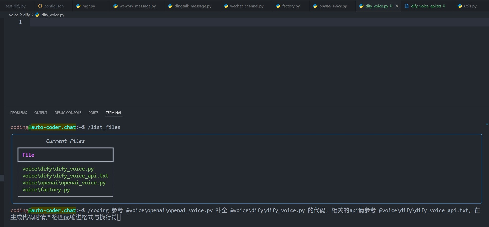

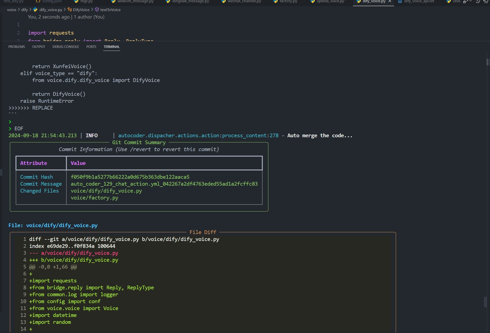