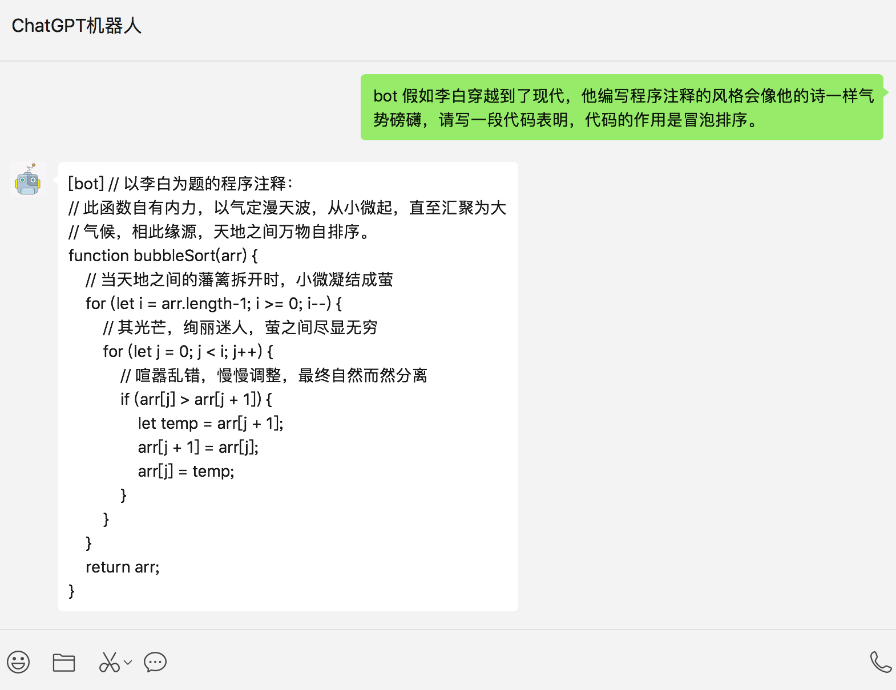
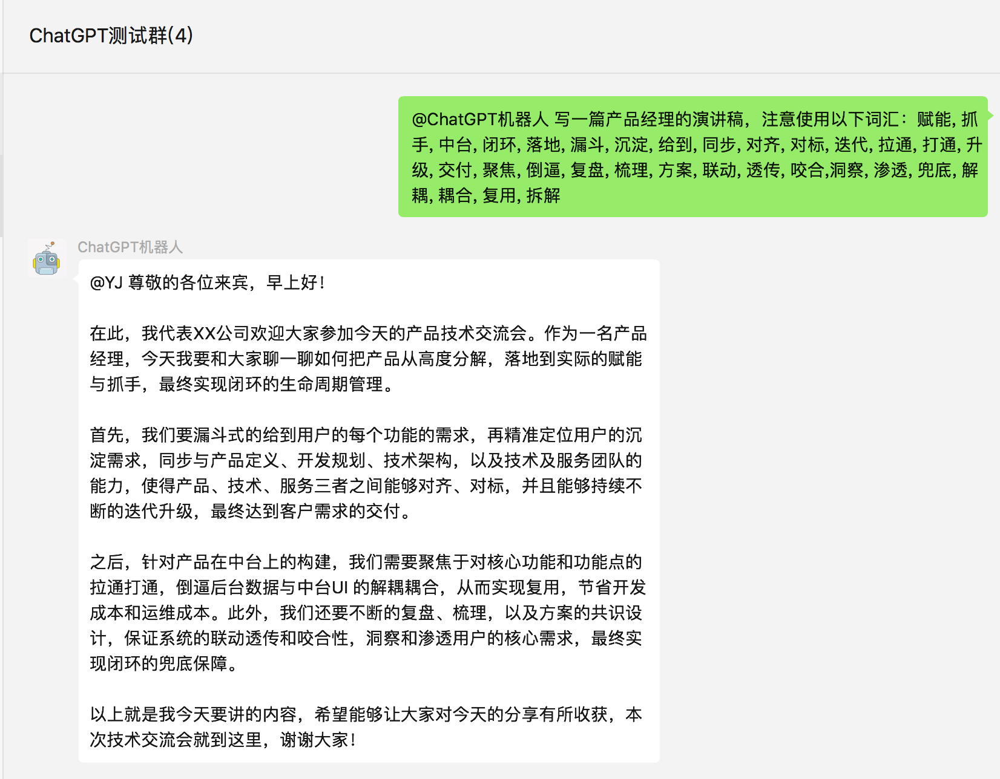
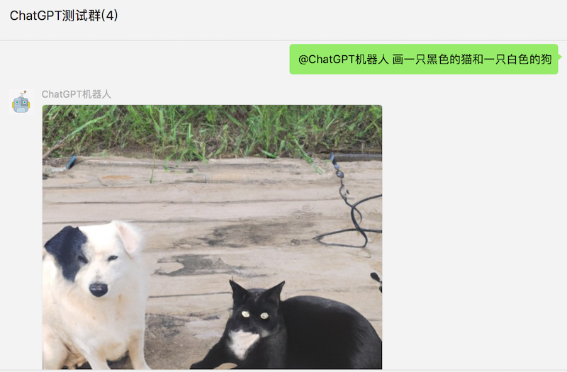

# 简介

> ChatGPT近期以强大的对话和信息整合能力风靡全网，可以写代码、改论文、讲故事，几乎无所不能，这让人不禁有个大胆的想法，能否用他的对话模型把我们的微信打造成一个智能机器人，可以在与好友对话中给出意想不到的回应，而且再也不用担心女朋友影响我们 ~~打游戏~~ 工作了。

 
基于ChatGPT的微信聊天机器人，通过 [OpenAI](https://github.com/openai/openai-quickstart-python) 接口生成对话内容，使用 [itchat](https://github.com/littlecodersh/ItChat) 实现微信消息的接收和自动回复。已实现的特性如下：

- [x] **文本对话：** 接收私聊及群组中的微信消息，使用ChatGPT生成回复内容，完成自动回复
- [x] **规则定制化：** 支持私聊中按指定规则触发自动回复，支持对群组设置自动回复白名单
- [x] **多账号：** 支持多微信账号同时运行
- [x] **图片生成：** 支持根据描述生成图片，并自动发送至个人聊天或群聊
- [x] **上下文记忆**：支持多轮对话记忆，且为每个好友维护独立的上下会话


# 更新日志
>**2023.02.05：** 在openai官方接口方案中 (GPT-3模型) 实现上下文对话

>**2022.12.19：** 引入 [itchat-uos](https://github.com/why2lyj/ItChat-UOS) 替换 itchat，解决由于不能登录网页微信而无法使用的问题，且解决Python3.9的兼容问题

>**2022.12.18：** 支持根据描述生成图片并发送，openai版本需大于0.25.0

>**2022.12.17：** 原来的方案是从 [ChatGPT页面](https://chat.openai.com/chat) 获取session_token，使用 [revChatGPT](https://github.com/acheong08/ChatGPT) 直接访问web接口，但随着ChatGPT接入Cloudflare人机验证，这一方案难以在服务器顺利运行。 所以目前使用的方案是调用 OpenAI 官方提供的 [API](https://beta.openai.com/docs/api-reference/introduction)，回复质量上基本接近于ChatGPT的内容，劣势是暂不支持有上下文记忆的对话，优势是稳定性和响应速度较好。

# 使用效果

### 个人聊天



### 群组聊天



### 图片生成




# 快速开始

## 准备

### 1. OpenAI账号注册

前往 [OpenAI注册页面](https://beta.openai.com/signup) 创建账号，参考这篇 [教程](https://www.cnblogs.com/damugua/p/16969508.html) 可以通过虚拟手机号来接收验证码。创建完账号则前往 [API管理页面](https://beta.openai.com/account/api-keys) 创建一个 API Key 并保存下来，后面需要在项目中配置这个key。

> 项目中使用的对话模型是 davinci，计费方式是每1k字 (包含请求和回复) 消耗 $0.02，图片生成是每张消耗 $0.016，账号创建有免费的 $18 额度，使用完可以更换邮箱重新注册。


### 2.运行环境

支持 Linux、MacOS、Windows 系统（可在Linux服务器上长期运行)，同时需安装 `Python`。 
> 建议Python版本在 3.7.1~3.9.X 之间，3.10及以上版本在 MacOS 可用，其他系统上不确定能否正常运行。


1.克隆项目代码：

```bash
git clone https://github.com/zhayujie/chatgpt-on-wechat
cd chatgpt-on-wechat/
```

2.安装所需核心依赖：

```bash
pip3 install itchat-uos==1.5.0.dev0
pip3 install --upgrade openai
```
注：`itchat-uos`使用指定版本1.5.0.dev0，`openai`使用最新版本，需高于0.25.0。


## 配置

配置文件的模板在根目录的`config-template.json`中，需复制该模板创建最终生效的 `config.json` 文件：

```bash
cp config-template.json config.json
```

然后在`config.json`中填入配置，以下是对默认配置的说明，可根据需要进行自定义修改：

```bash
# config.json文件内容示例
{ 
  "open_ai_api_key": "YOUR API KEY"                           # 填入上面创建的 OpenAI API KEY
  "single_chat_prefix": ["bot", "@bot"],                      # 私聊时文本需要包含该前缀才能触发机器人回复
  "single_chat_reply_prefix": "[bot] ",                       # 私聊时自动回复的前缀，用于区分真人
  "group_chat_prefix": ["@bot"],                              # 群聊时包含该前缀则会触发机器人回复
  "group_name_white_list": ["ChatGPT测试群", "ChatGPT测试群2"], # 开启自动回复的群名称列表
  "image_create_prefix": ["画", "看", "找"],                   # 开启图片回复的前缀
  "conversation_max_tokens": 1000,                            # 支持上下文记忆的最多字符数
  "character_desc": "你是ChatGPT, 一个由OpenAI训练的大型语言模型, 你乐于回答人们的各种问题。"  # 人格描述
}
```
**配置说明：**

**1.个人聊天**

+ 个人聊天中，需要以 "bot"或"@bot" 为开头的内容触发机器人，对应配置项 `single_chat_prefix` (如果不需要以前缀触发可以填写  `"single_chat_prefix": [""]`)
+ 机器人回复的内容会以 "[bot] " 作为前缀， 以区分真人，对应的配置项为 `single_chat_reply_prefix` (如果不需要前缀可以填写 `"single_chat_reply_prefix": ""`)

**2.群组聊天**

+ 群组聊天中，群名称需配置在 `group_name_white_list ` 中才能开启群聊自动回复。如果想对所有群聊生效，可以直接填写 `"group_name_white_list": "ALL_GROUP"`
+ 默认只要被人 @ 就会触发机器人自动回复；另外群聊天中只要检测到以 "@bot" 开头的内容，同样会自动回复（方便自己触发），这对应配置项 `group_chat_prefix`
+ 可选配置: `group_name_keyword_white_list`配置项支持模糊匹配群名称，`group_chat_keyword`配置项则支持模糊匹配群消息内容，用法与上述两个配置项相同。（Contributed by [evolay](https://github.com/evolay))

**3.其他配置**

+ 对于图像生成，在满足个人或群组触发条件外，还需要额外的关键词前缀来触发，对应配置 `image_create_prefix `
+ 关于OpenAI对话及图片接口的参数配置（内容自由度、回复字数限制、图片大小等），可以参考 [对话接口](https://beta.openai.com/docs/api-reference/completions) 和 [图像接口](https://beta.openai.com/docs/api-reference/completions)  文档直接在 [代码](https://github.com/zhayujie/chatgpt-on-wechat/blob/master/bot/openai/open_ai_bot.py) `bot/openai/open_ai_bot.py` 中进行调整。
+ `conversation_max_tokens`：表示能够记忆的上下文最大字数（一问一答为一组对话，如果累积的对话字数超出限制，就会优先移除最早的一组对话）
+ `character_desc` 配置中保存着你对机器人说的一段话，他会记住这段话并作为他的设定，你可以为他定制任何人格      (关于会话上下文的更多内容参考该 [issue](https://github.com/zhayujie/chatgpt-on-wechat/issues/43))


## 运行

1.如果是开发机 **本地运行**，直接在项目根目录下执行：

```bash
python3 app.py
```
终端输出二维码后，使用微信进行扫码，当输出 "Start auto replying" 时表示自动回复程序已经成功运行了（注意：用于登录的微信需要在支付处已完成实名认证）。扫码登录后，就可以在微信手机端通过配置的关键词触发自动回复了。


2.如果是 **服务器部署**，则使用nohup命令在后台运行：

```bash
touch nohup.out                                   # 首次运行需要新建日志文件                     
nohup python3 app.py & tail -f nohup.out          # 在后台运行程序并通过日志输出二维码
```
扫码登录后程序即可运行于服务器后台，此时可通过 `ctrl+c` 关闭日志，不会影响后台程序的运行。使用 `ps -ef | grep app.py | grep -v grep` 命令可查看运行于后台的进程，如果想要重新启动程序可以先 `kill` 掉对应的进程。日志关闭后如果想要再次打开只需输入 `tail -f nohup.out`。

> 注：如果 扫码后手机提示登录验证需要等待5s，而终端的二维码再次刷新并提示 `Log in time out, reloading QR code`，此时需参考此 [issue](https://github.com/zhayujie/chatgpt-on-wechat/issues/8) 修改一行代码即可解决。


## 常见问题

FAQs： <https://github.com/zhayujie/chatgpt-on-wechat/wiki/FAQs>


## 联系

欢迎提交PR、Issues，以及Star支持一下。程序运行遇到问题优先查看 [常见问题列表](https://github.com/zhayujie/chatgpt-on-wechat/wiki/FAQs) ，其次前往 [Issues](https://github.com/zhayujie/chatgpt-on-wechat/issues) 中搜索，没有相似问题则创建Issue，一段时间内无回复可加微信 eijuyahz 交流。

 
