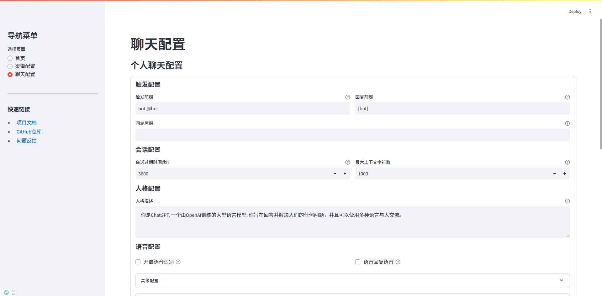

chatgpt-on-wechat（简称CoW）项目是基于大模型的智能对话机器人，支持微信公众号、企业微信应用、飞书、钉钉接入，可选择GPT3.5/GPT4.0/Claude/Gemini/LinkAI/ChatGLM/KIMI/文心一言/讯飞星火/通义千问/LinkAI/Coze，能处理文本、语音和图片，通过插件访问操作系统和互联网等外部资源，支持基于自有知识库定制企业AI应用。

# 简介

最新版本支持的功能如下：

-  ✅   **多端部署：** 有多种部署方式可选择且功能完备，目前已支持微信公众号、企业微信应用、飞书、钉钉等部署方式
-  ✅   **基础对话：** 私聊及群聊的消息智能回复，支持多轮会话上下文记忆，支持 GPT-3.5, GPT-4o-mini, GPT-4o,  GPT-4, Claude-3.5, Gemini, 文心一言, 讯飞星火, 通义千问，ChatGLM-4，Kimi(月之暗面), MiniMax, GiteeAI,Coze
-  ✅   **语音能力：** 可识别语音消息，通过文字或语音回复，支持 azure, baidu, google, openai(whisper/tts) 等多种语音模型
-  ✅   **图像能力：** 支持图片生成、图片识别、图生图（如照片修复），可选择 Dall-E-3, stable diffusion, replicate, midjourney, CogView-3, vision模型
-  ✅   **丰富插件：** 支持个性化插件扩展，已实现多角色切换、文字冒险、敏感词过滤、聊天记录总结、文档总结和对话、联网搜索等插件
-  ✅   **知识库：** 通过上传知识库文件自定义专属机器人，可作为数字分身、智能客服、私域助手使用，基于 [LinkAI](https://link-ai.tech) 实现

## 声明

1. 本项目遵循 [MIT开源协议](/LICENSE)，仅用于技术研究和学习，使用本项目时需遵守所在地法律法规、相关政策以及企业章程，禁止用于任何违法或侵犯他人权益的行为
2. 境内使用该项目时，请使用国内厂商的大模型服务，并进行必要的内容安全审核及过滤
3. 本项目主要接入协同办公平台，推荐使用公众号、企微自建应用、钉钉、飞书等接入通道，其他通道为历史产物已不维护
4. 任何个人、团队和企业，无论以何种方式使用该项目、对何对象提供服务，所产生å的一切后果，本项目均不承担任何责任

## 部署

1. 下载项目代码
```
git clone https://github.com/JC0v0/chatgpt-on-wechat.git
```

2. 安装依赖
```
pip install -r requirements.txt
```

3. 运行项目
```
python app.py
```

4. 访问项目

运行后，访问 http://localhost:8501 即可看到项目配置界面。



