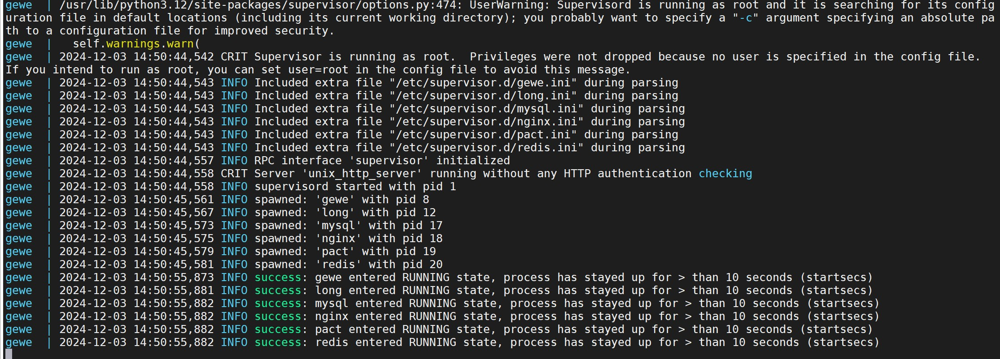

# 1. gewechat channel简介

Gewechat channel是基于[Gewechat](https://github.com/Devo919/Gewechat)项目实现的微信个人号通道，使用ipad协议登录，该协议能获取到wxid，能发送语音条消息，相比itchat协议更稳定。

api文档地址为：[gewechat api](https://apifox.com/apidoc/shared-69ba62ca-cb7d-437e-85e4-6f3d3df271b1/api-197179336)

# 2. gewechat 服务部署教程

gewechat 服务需要自行部署，[dify-on-wechat](https://github.com/hanfangyuan4396/dify-on-wechat) 项目只负责对接gewechat服务，请参考下方教程部署gewechat服务。

## 2.1 下载镜像

感谢gewechat交流群中的大佬 `@1H` 重构了镜像,让gewe镜像不依赖cgroup和docker --privilege,可以在更高版本的ubuntu、debian以及macos系统上运行。

```bash
# 从阿里云镜像仓库拉取(国内)
docker pull registry.cn-chengdu.aliyuncs.com/tu1h/wechotd:alpine
docker tag registry.cn-chengdu.aliyuncs.com/tu1h/wechotd:alpine gewe

# 或从GitHub镜像仓库拉取
docker pull ghcr.io/tu1h/wechotd/wechotd:alpine
docker tag ghcr.io/tu1h/wechotd/wechotd:alpine gewe
```

## 2.2 使用docker启动

```bash
mkdir -p gewechat/data  
docker run -itd -v gewechat/data:/root/temp -p 2531:2531 -p 2532:2532 --restart=always --name=gewe gewe
```

## 2.3 使用docker compose启动

首先创建必要的数据目录:

```bash
mkdir -p gewechat/data
```

创建 `docker-compose.yml` 文件:

```yaml
version: '3'
services:
  gewechat:
    image: gewe
    container_name: gewe
    volumes:
      - ./gewechat/data:/root/temp
    ports:
      - "2531:2531"
      - "2532:2532"
    restart: always
```

运行:
```bash
docker compose up -d
```

## 2.4 成功日志

看到如下日志，表示gewechat服务启动成功

<div align="center">

</div>

# 3. 使用dify-on-wechat对接gewechat服务

## 3.1 gewechat相关参数配置

在config.json中需要配置以下gewechat相关的参数：

```bash
{
    "channel_type": "gewechat"   # 通道类型，请设置为gewechat    
    "gewechat_token": "",        # gewechat服务的token，用于接口认证
    "gewechat_app_id": "",       # gewechat服务的应用ID
    "gewechat_base_url": "http://本机ip:2531/v2/api",  # gewechat服务的API基础URL
    "gewechat_callback_url": "http://本机ip:9919/v2/api/callback/collect", # 回调URL，用于接收消息
    "gewechat_download_url": "http://本机ip:2532/download", # 文件下载URL
}
```

参数说明：
- `gewechat_token`: gewechat服务的认证token，首次登录时，可以留空，启动dify-on-wechat服务时，会**自动获取token**并**自动保存到config.json**中
- `gewechat_app_id`: gewechat服务分配的设备ID，首次登录时，可以留空，启动dify-on-wechat服务时，会**自动获取appid**并**自动保存到config.json**中
- `gewechat_base_url`: gewechat服务的API基础地址，请根据实际情况配置，如果gewechat服务与dify-on-wechat服务部署在同一台机器上，可以配置为`http://本机ip:2531/v2/api`
- `gewechat_callback_url`: 接收gewechat消息的回调地址，请根据实际情况配置，如果gewechat服务与dify-on-wechat服务部署在同一台机器上，可以配置为`http://本机ip:9919/v2/api/callback/collect`，如无特殊需要，请使用9919端口号
- `gewechat_download_url`: 文件下载地址，用于下载语音、图片等文件，请根据实际部署情况配置，如果gewechat服务与dify-on-wechat服务部署在同一台机器上，可以配置为`http://本机ip:2532/download`

注意：请确保您的回调地址(callback_url)，即dify-on-wechat启动的回调服务可以被gewechat服务正常访问到。如果您使用Docker部署，需要注意网络配置，确保容器之间可以正常通信。

## 3.2 dify相关参数配置

在config.json中需要配置以下dify相关参数：

```bash
{
  "dify_api_base": "https://api.dify.ai/v1",    # dify base url
  "dify_api_key": "app-xxx",                    # dify api key
  "dify_app_type": "chatbot",                   # dify应用类型,对应聊天助手
  "channel_type": "gewechat",                   # 通道类型设置为gewechat
  "model": "dify",                              # 模型名称设置为dify
  "single_chat_prefix": [""],                   # 私聊触发前缀
  "single_chat_reply_prefix": "",               # 私聊回复前缀
  "group_chat_prefix": ["@bot"],                # 群聊触发前缀
  "group_name_white_list": ["ALL_GROUP"],       # 允许响应的群组
}
```

关于dify_api_base、dify_api_key等参数的获取方法,请参考文章 [手摸手教你把 Dify 接入微信生态](https://docs.dify.ai/v/zh-hans/learn-more/use-cases/dify-on-wechat)。

## 3.3 启动dify-on-wechat服务

完成上述配置后，你需要确保gewechat服务已正常启动，dify-on-wechat的依赖已安装(见 [dify-on-wechat项目README](https://github.com/hanfangyuan4396/dify-on-wechat) 或 [手摸手教你把 Dify 接入微信生态](https://docs.dify.ai/v/zh-hans/learn-more/use-cases/dify-on-wechat) )，然后运行以下命令启动服务:

```bash
python app.py
```
启动成功后，可以看到如下日志信息，注意token和appid会自动保存到config.json，无需手动保存

<div align="center">

</div>

# 4. gewechat_channel 服务的限制
1. gewechat 要求必须搭建服务到**同省**服务器或者电脑里方可正常使用，即登录微信的手机与gewechat服务必须在同一省
2. gewechat 开源框架**只支持**下载接收到的图片，不支持下载文件
3. gewechat_channel 目前暂时**只支持接收文字消息**，**只支持发送文字消息与图片消息**，后续支持的消息类型会逐步完善
4. 此项目仅用于个人娱乐场景，请**勿用于任何商业场景**
