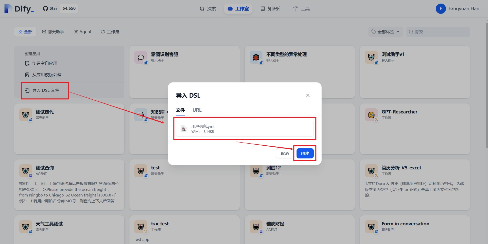
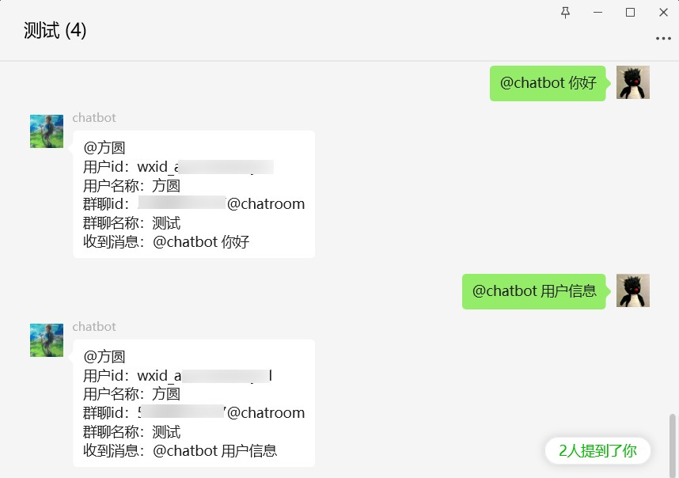

# 用户信息对接dify

## 1. 简介

新增用户信息对接dify的能力，会把用户id、用户名称、群聊id、群聊名称信息传递给dify，搭配 [**gewechat_channel**](../gewechat/README.md) 提供的wxid与chatroomid，
可以在dify中识别出每个用户，实现个性化服务。

此功能参考了 [wechat-assistant-pro](https://github.com/leochen-g/wechat-assistant-pro/issues/76)

## 2.快速开始

### 2.1 创建Dify应用

下载提供的 [用户信息.yml](../../dsl/用户信息.yml) 文件，在Dify中通过导入DSL文件的方式创建应用，如下图所示:

<div align="center">

</div>

### 2.2 添加用户信息变量

如下图所示，在刚刚创建的应用中，已经预先创建了`user_id`、`user_name`、`room_id`、`room_name`变量，在工作流中可以使用这些变量来唯一标识用户或获取用户信息，从而实现对不同用户的个性化服务。

<div align="center">

</div>

你可以在自己创建的工作流中添加上述4个变量，但是在配置变量时，需要注意:
1. 保证变量名一致
2. 最大长度设置大一些，推荐128
3. **取消**勾选必填

### 2.3 发布应用，启动dify-on-wechat服务

发布此应用，并获取dify_api_base、dify_api_key，详情请参考[**手摸手教你把 Dify 接入微信生态**](https://docs.dify.ai/v/zh-hans/learn-more/use-cases/dify-on-wechat)，不再赘述。

在dify-on-wechat的config.json中需要配置以下dify相关参数：

```bash
{
  "dify_api_base": "https://api.dify.ai/v1",    # dify base url
  "dify_api_key": "app-xxx",                    # dify api key
  "dify_app_type": "chatbot",                   # dify应用类型,对应聊天助手
  "channel_type": "gewechat",                   # 通道类型设置为gewechat
  "model": "dify",                              # 模型名称设置为dify
  "single_chat_prefix": [""],                   # 私聊触发前缀
  "single_chat_reply_prefix": "",               # 私聊回复前缀
  "group_chat_prefix": ["@bot"],                # 群聊触发前缀
  "group_name_white_list": ["ALL_GROUP"],       # 允许响应的群组
}
```

上述的channel_type使用了 **gewechat**，gewechat_channel 的使用方法请参考 [**gewechat_channel**](../gewechat/README.md)

### 2.4 接收用户信息测试

分别测试私聊和群聊，在下图中可以看到能够正常获取到用户信息并返回。

<div align="center">

</div>

<div align="center">

</div>