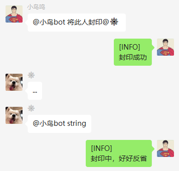
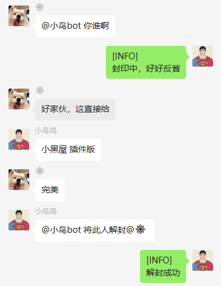
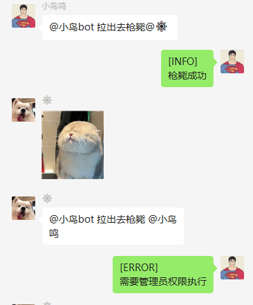
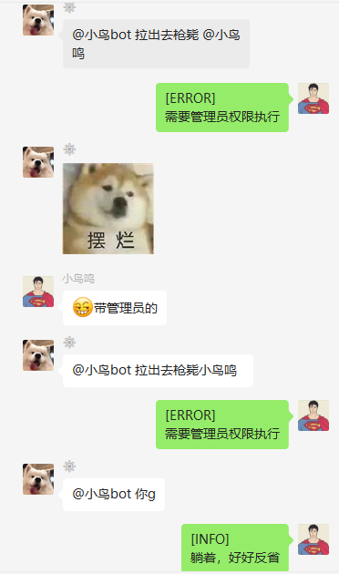
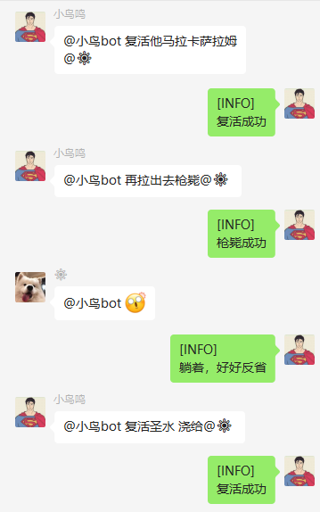

# blackroom
chatgpt-on-wechat plugins

## 群管控
## 烦人精退散











### json格式：
```
{
  "incantation" : ["枪毙","该用户已经枪毙","枪毙成功"],   
  "amnesty" : ["复活","躺着，好好反省","复活成功","该用户没有要枪毙"],   
  "admin_nickname" : ["小鸟鸣"]
}
```

```
{
  "incantation" : ["封印","该用户已经封印","封印成功"],   
  "amnesty" : ["解封","封印中，好好反省","解封成功","该用户没有被封印"],   
  "admin_nickname" : ["小鸟鸣"]
}
```

