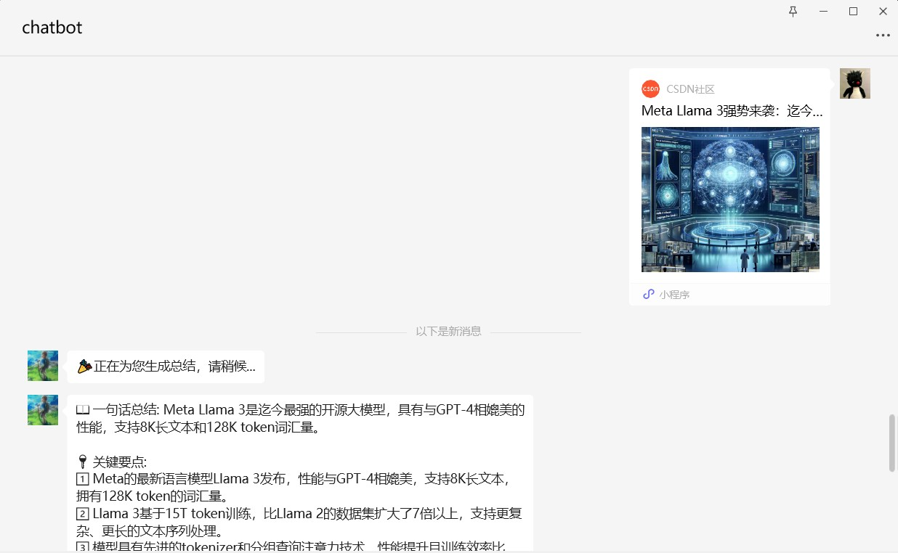

# jina_sumary
ChatGPT on WeChat项目插件, 使用jina reader和ChatGPT总结网页链接内容

支持总结公众号、小红书、csdn等分享卡片链接(有的卡片链接会触发验证，一般直链没有此问题)

<div align="center">

</div>

<div align="center">

</div>

<div align="center">

</div>

config.json 配置说明
```bash
{
  "jina_reader_base": "https://r.jina.ai",           # jina reader链接，默认为https://r.jina.ai
  "open_ai_api_base": "https://api.openai.com/v1",   # chatgpt chat url
  "open_ai_api_key":  "sk-xxx",                      # chatgpt api key
  "open_ai_model": "gpt-3.5-turbo",                  # chatgpt model
  "max_words": 8000,                                 # 网页链接内容的最大字数，防止超过最大输入token，使用字符串长度简单计数
  "white_url_list": [],                              # url白名单, 列表为空时不做限制，黑名单优先级大于白名单，即当一个url既在白名单又在黑名单时，黑名单生效
  "black_url_list": ["https://support.weixin.qq.com", "https://channels-aladin.wxqcloud.qq.com"],  # url黑名单，排除不支持总结的视频号等链接
  "prompt": "我需要对下面的文本进行总结，总结输出包括以下三个部分：\n📖 一句话总结\n🔑 关键要点,用数字序号列出3-5个文章的核心内容\n🏷 标签: #xx #xx\n请使用emoji让你的表达更生动。"                           # 链接内容总结提示词
}
```
