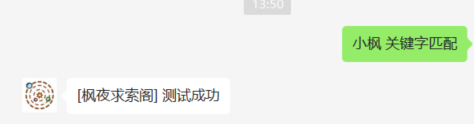

# 目的
关键字匹配并回复

# 试用场景
目前是在微信公众号下面使用过。

# 使用步骤
1. 复制 `config.json.template` 为 `config.json`
2. 在关键字 `keyword` 新增需要关键字匹配的内容
3. 重启程序做验证

# 验证结果

# 功能优化
1. 优化关键字匹配的方式，之前是匹配关键词一一对应，现在可以支持单个关键词匹配多个回复（随机选择一个回复）。